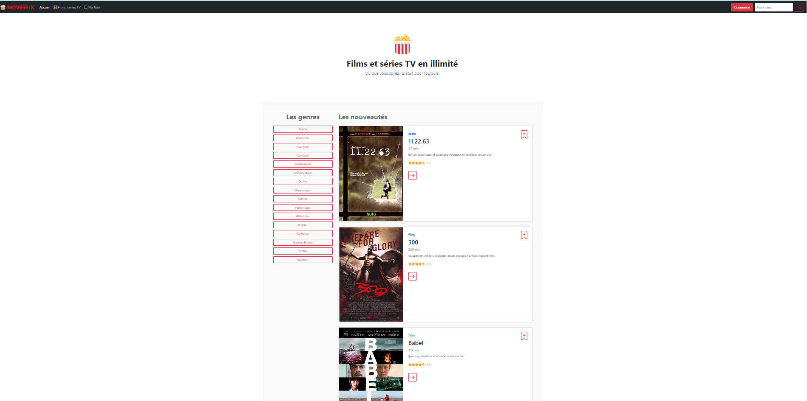
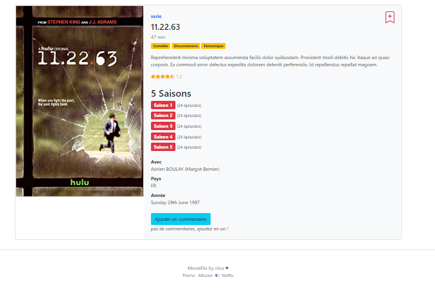
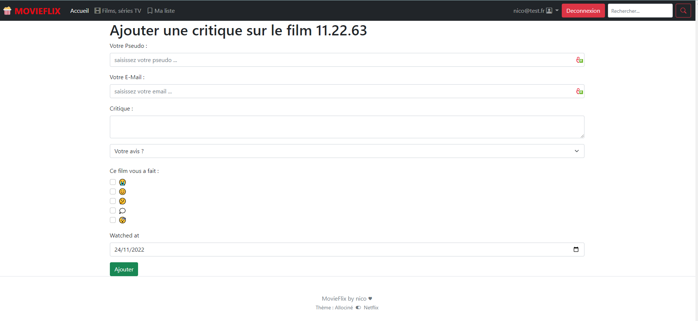
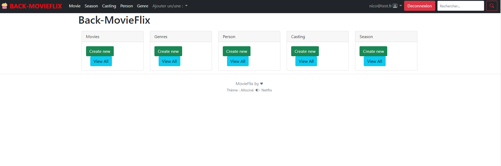
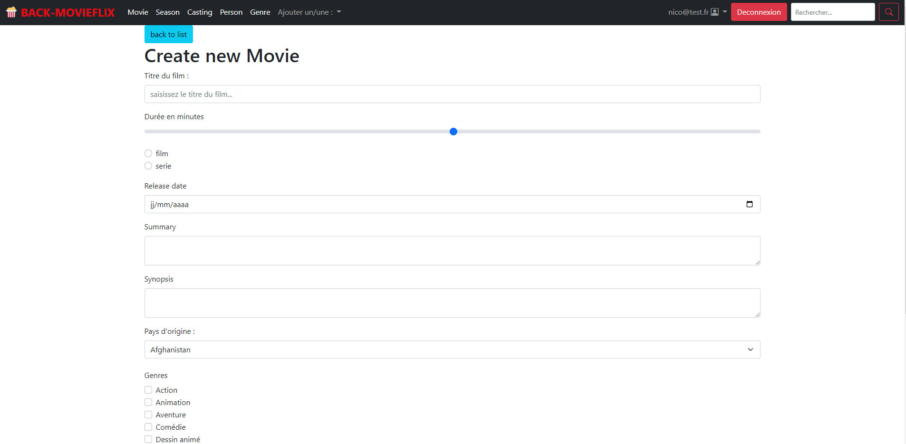

## Projet symfony basé sur une imitation de netflix (mais en mieux ou pas)

### Page d'accueil avec l'ensemble une limitation de 10 films/série par page dynamisé

### Détail du film dynamisé

### Une fonction qui permets d'ajouter un commentaire si l'utilisateur à le droit et est loggé

### Un backoffice qui permets de gérer tout le CRUD de toutes les entités

